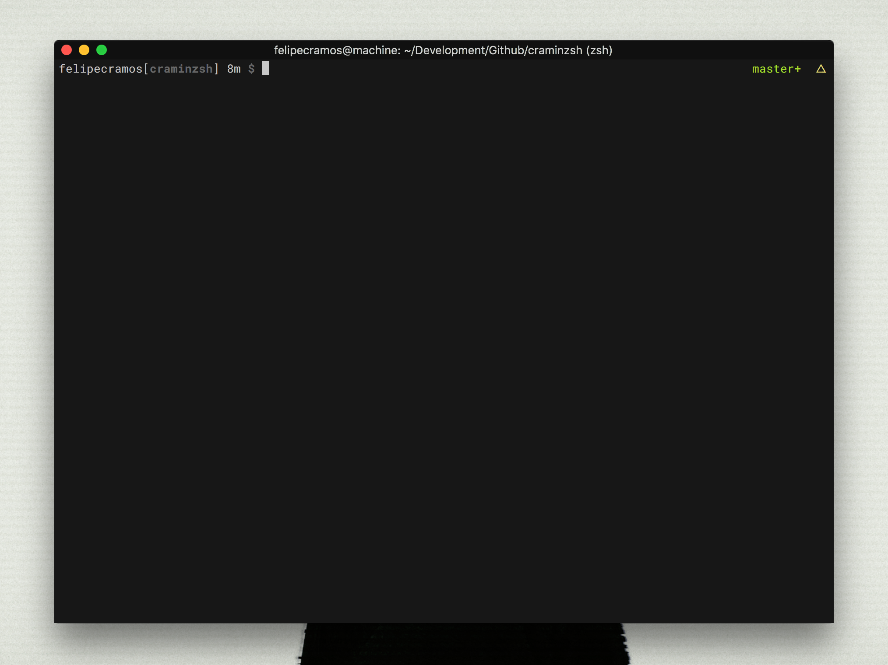

### C R A M I N Z S H


A minimal zsh interface, with support to github plugins.

#### INSTALL
You can do it by the lazy way by cloning the repo on any place with `git clone [link]` and then typing inside your `zsh` shell:
```sh
cd craminzsh;
zsh src/install.sh
# it should copy the theme file to the correct directory
```

Or, doing by the normal way, just copy the `craminzsh.zsh-theme` to the `$ZSH_CUSTOM/themes` folder and edit on your `.zshrc` with:
```sh
ZSH_THEME="craminzsh"
```

#### OTHERS
Setup used for the screenshot:
+ iTerm 2
+ Roboto Mono 13pt for Powerline
+ Molokai Colorscheme for iTerm 2

##### AUTHORSHIP
This is a modification of the *HYPERZSH* theme, made by FelipeCRamos. This project also uses the *MIT license*.
